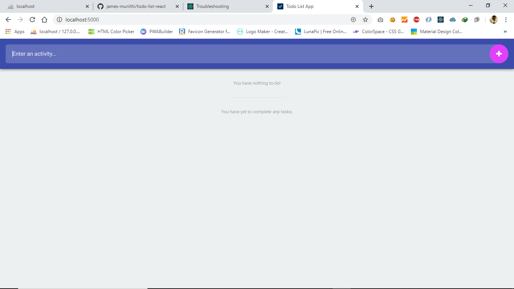
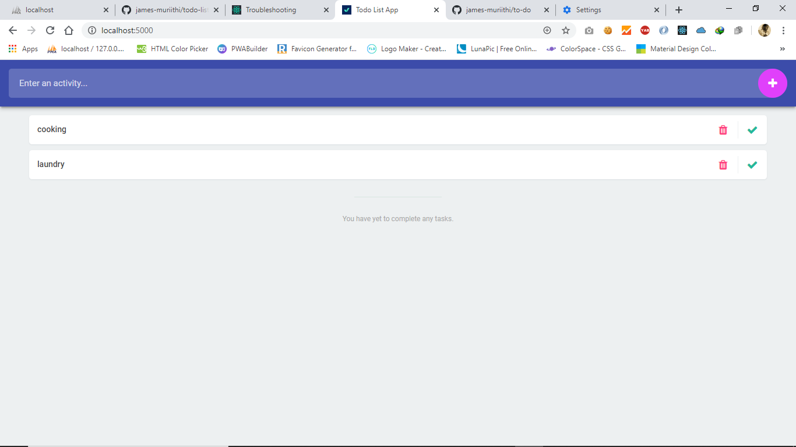

[](https://app.netlify.com/sites/my-todolistapp/deploys)

# Todo List App
A simple todo list app built in react 





## Available Scripts

In the project directory, you can run:

```
$ npm start 
```


Runs the app in the development mode.<br />
Open [http://localhost:3000](http://localhost:3000) to view it in the browser.

The page will reload if you make edits.<br />
You will also see any lint errors in the console.

```
$ npm build
```

Builds the app for production to the `build` folder.<br />
It correctly bundles React in production mode and optimizes the build for the best performance.

The build is minified and the filenames include the hashes.<br />
Your app is ready to be deployed!

See the section about [deployment](https://facebook.github.io/create-react-app/docs/deployment) for more information.
